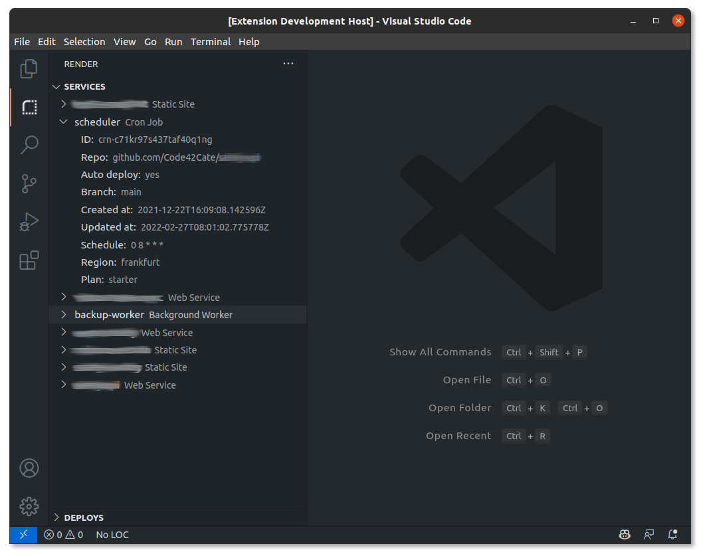

# Render.com Visual Studio Code Extension

This extension integrates with [Render](https://render.com) to show your Render services in your sidebar.

## Setup
After installing the extension, go to your "Account Settings" in render and create an API key. Copy the key and paste it into the input field after running the command 

`>Render Extension: Setup`.

Open the render view in your sidebar and you should see your services listed. (You might need to reload the vscode window to re-fetch the services if the first time failed because of a missing api key)

## Features

Right now this extension only shows some information about your services. I plan on adding more functionality, such as showing your deploys, triggering deploys, showing jobs, and anything that the render api supports :) 

## Known Issues

### 401 Error

You did not add your api key or it is invalid. Follow the steps in the "Setup" section.

## Release Notes
### 0.0.2

Fixed:
 - Add extension icon

### 0.0.1

Initial release of extension.
Added:
- List of render services in sidebar
